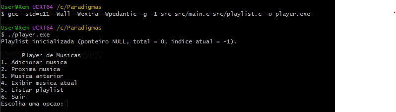
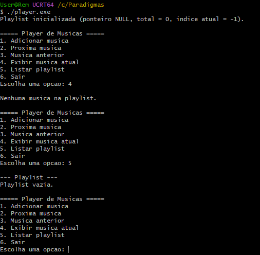
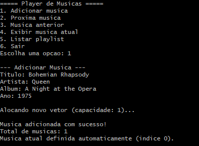
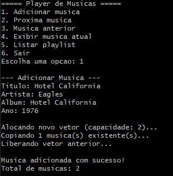
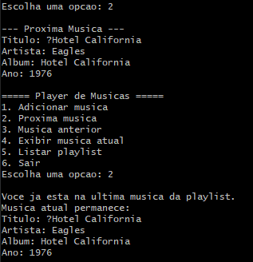
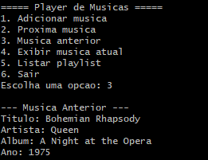
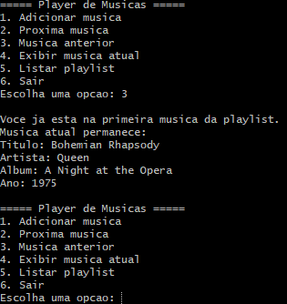
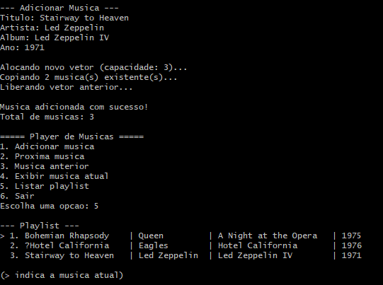
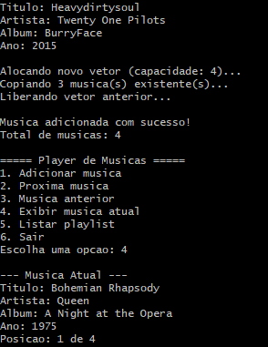
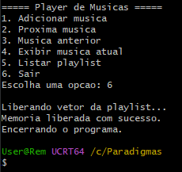

# Plano de testes

Os testes abaixo são a referência de comportamento para o player. Pessoa 4 deve marcar cada item como `PASSOU` ou `FALHOU` e anexar a saída observada no pull request.

| ID | Cenário | Resultado esperado |
|---|---|---|
| T1 | Início vazio | ponteiro `NULL`, total `0`, índice `-1`; exibição e listagem informam playlist vazia |
| T2 | Adicionar primeira música | vetor com capacidade 1; total `1`; índice atual passa a `0` |
| T3 | Adicionar segunda música | novo vetor é alocado; registro anterior é copiado; vetor antigo é liberado |
| T4 | Próxima música | índice avança e a segunda música é exibida |
| T5 | Avançar além da última | índice não muda e o programa informa que já está na última |
| T6 | Música anterior | índice retrocede e a música anterior é exibida |
| T7 | Retroceder antes da primeira | índice não muda e o programa informa que já está na primeira |
| T8 | Terceira música e listagem | as três músicas aparecem; `>` indica a música atual |
| T9 | Exibir música atual | título, artista, álbum, ano e posição são exibidos |
| T10 | Fluxo completo e saída | navegação, quarta inserção e listagem funcionam; toda a memória é liberada ao sair |

## Casos adicionais de qualidade

- selecionar uma opção inexistente no menu;
- informar texto vazio;
- informar texto maior que o campo;
- informar letras quando o programa espera um número;
- usar ano fora do intervalo definido pela equipe;
- tentar navegar em playlist vazia;
- simular falha de alocação, se houver mecanismo de teste;
- executar a versão final com sanitizador ou ferramenta equivalente disponível no ambiente.


## Registro de Execução
**Versão do commit:** 696554e
**Data:** 06/09/2026
**Responsável:** Daniel Fernandes Santos RA:2403844 (Pessoa 4). 

### Compilação de Rigor (-Wall -Wextra -Wpedantic)

```bash
User@Rem UCRT64 /c/Paradigmas
$ gcc -std=c11 -Wall -Wextra -Wpedantic -g -I src src/main.c src/playlist.c -o player.exe

User@Rem UCRT64 /c/Paradigmas
$ ./player.exe
Playlist inicializada (ponteiro NULL, total = 0, indice atual = -1).



Compilação (-Wall -Wextra -Wpedantic): PASSOU (0 erros, 0 warnings).

T1: PASSOU — Ponteiro NULL, total = 0, índice atual = -1. Opções 4 e 5 informaram playlist vazia conforme esperado.


T2: PASSOU — Primeira música adicionada. Vetor com capacidade 1 alocado e índice atual configurado para 0.


T3: PASSOU — Novo vetor alocado (capacidade 2), registro anterior copiado e vetor antigo liberado com sucesso.


T4: PASSOU — Índice avançou para a segunda música (Hotel California).


T5: PASSOU — Programa impediu navegação além do limite superior da playlist.


T6: PASSOU — Índice retrocedeu com sucesso para a primeira música (Bohemian Rhapsody).


T7: PASSOU — Programa impediu retrocesso além do limite inferior (índice 0).


T8: PASSOU — Terceira música inserida com sucesso (capacidade 3). Listagem exibiu os 3 itens com indicador (>) na posição 1.


T9: PASSOU — Exibição detalhada da música atual com posição correta.


T10: PASSOU — Fluxo completo finalizado e memória liberada no encerramento.


Casos adicionais:
- Tentativa de navegação em playlist vazia e bloqueios de limites superior/inferior validados com sucesso.

Falhas abertas: Nenhuma falha encontrada.